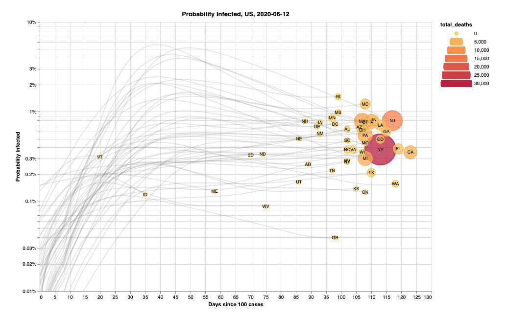

# Covid-vis

Data and code for my visualizations showing:

- Timeseries of new cases per million in the US and around the world.
- The probability of infection by state and county in the US.

The interactive visualizations are available on my blog [here](https://pstblog.com/2020/06/10/covid-vis).

 

